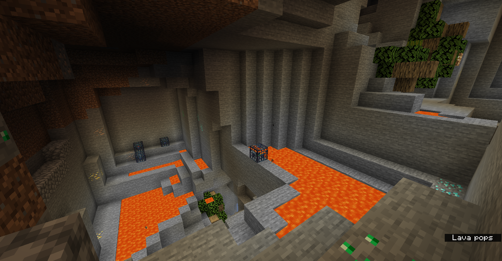

# DwarfCraft

DwarfCraft is a map generator for Minecraft. It aims to make living underground more interesting. You've never seen caves like these before!

This is also, to the very best of my knowledge, the first project to use the Amulet API outside of the Amulet Editor.

## Pictures

[Full Album](https://imgur.com/a/o8WgLtD)

## FAQ

### How do I run DwarfCraft?

Currently, the only way to run DwarfCraft is from source. Pipenv makes this easy as py.

1. Install Python 3.8+
2. Install Pipenv (`pip install pipenv`)
3. Navigate to the directory, and run `pipenv install`. This might take a while...
4. Run `pipenv run python main.py <path to world> <size>` to run DwarfCraft from within the pipenv shell.

### Where can I find example saves, if I don't want to run DwarfCraft?

Example saves can be found in [releases](https://github.com/architectdrone/DwarfCraft/releases).

### What if I want to run DwarfCraft, but I don't want to download all that stuff?

I am working on creating an exe for DwarfCraft. As it turns out, this is fairly difficult, due to some of the dependencies needed.

### I am familiar with the Amulet API... why did you do <dumb thing\> when you could do <smart thing\>?

I did <dumb thing\> because I literally have no idea what I'm doing. I learned how to use Amulet from looking at the source code and the operations that are a part of Amulet Core. Please, make an issue explaining the right way to do it, or, better yet, a pull request. Maybe we can make it easier for others to build similar programs by examining mine!

### (Technical) What the heck is Perlin Probability?

A really dumb hack. The motivation is that I wanted to use smooth noise, to generate clusters of things. Obviously, Perlin Noise is the go to for that kind of thing. The problem comes from the fact that numbers closer to 0.5 are more likely to appear. So, say I wanted things to spawn 30% of the time. I couldn't just do 

`if perlin < 0.3`

Like I can do with random.random(), because it wouldn't be true 30% of the time. So what I did was I measured the distance from 0.5, and then ran a program that found the probability that any given distance would be less than the current distance. (For example, if the distance 0.2 had a probability 70%, that means that distances less than 0.2 occur 70% of the time.) Then I ran a linear regression on the output data and found an equation. (This equation can be found in the probability_to_distance function)

Experimentation shows that this method works well enough for my purposes. However, it is obviously far from perfect. If there is a better way, please tell me!

## Special Thanks

Beta Testers: Cocacolacore

Inspiration: MCDungeonGenerator, by BubbleMod
